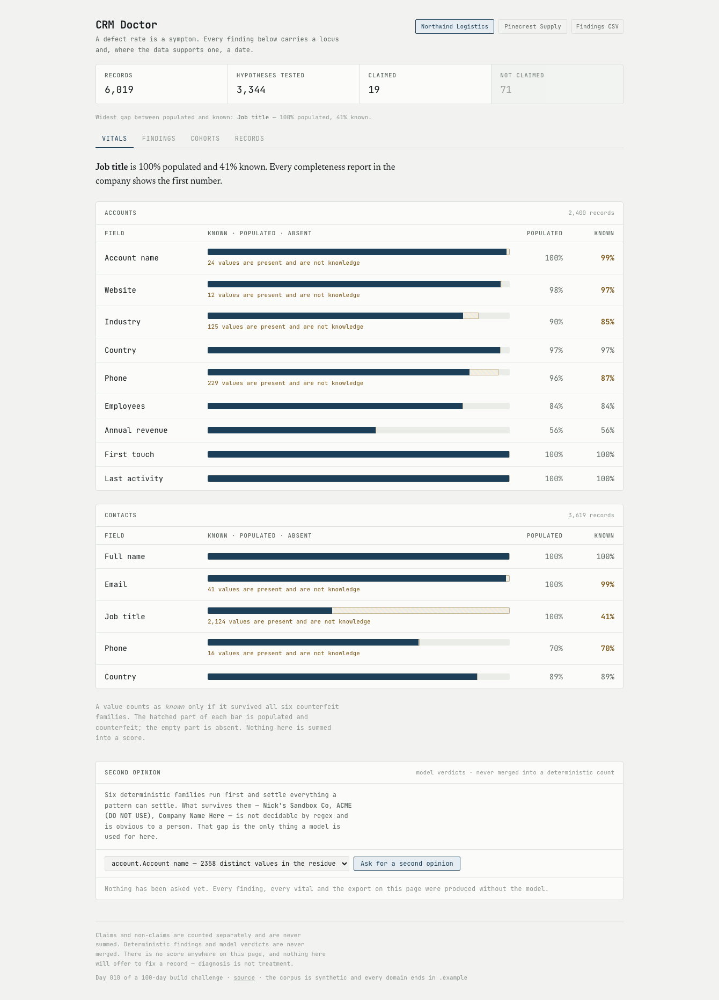
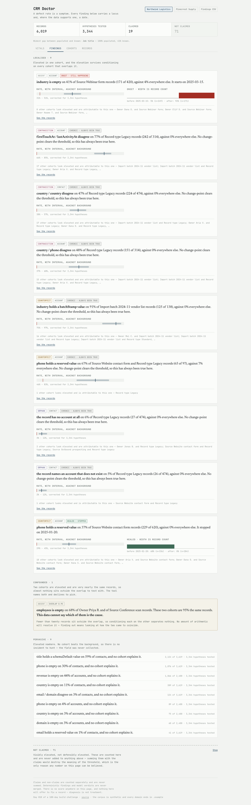
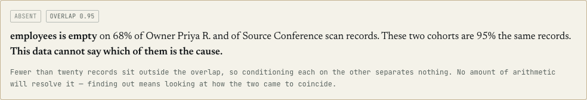
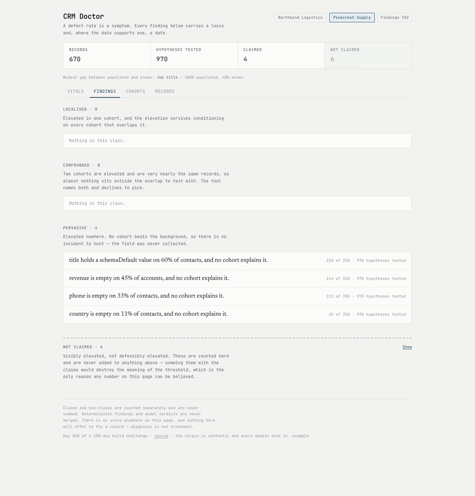
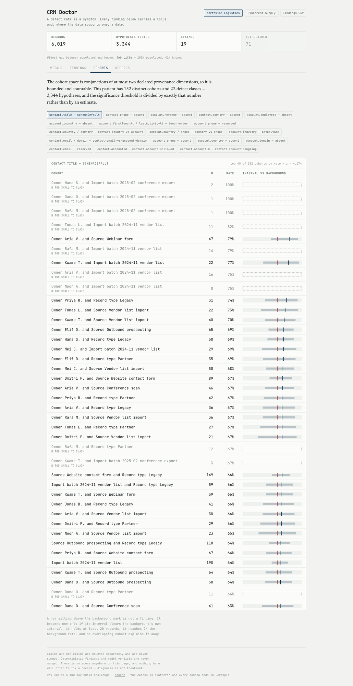

# CRM Doctor

A diagnostic tool for CRM data. It refuses to report a defect rate without saying **where** the defect comes from and **when** it started, and it refuses to call a field complete when its values are placeholders.

[Live demo](https://crm-doctor-eight.vercel.app) · Day 010 of a 100-day building challenge



## Why I Built This

Every CRM audit produces the same artifact: a number. *41% of our accounts are missing industry.* That number gets onto a slide, someone buys an enrichment vendor, the number goes down for a quarter, and then it comes back — because nobody ever found out where it came from.

A defect rate is a **symptom**, and symptoms are not actionable.

Bad CRM data is not a fog that settles evenly. It is **produced**, by a small number of identifiable mechanisms. A form went live on a date and quietly stopped collecting a field. An import batch wrote the same wrong value four hundred times in one afternoon. An integration ran once with the wrong field mapping and overwrote a column. One rep fills company and never fills country, and has done for two years. Each of those has a **locus** — a cohort of records where it lives — and an **onset** — a date it started, and sometimes a date it stopped. A tool that reports `41%` and stops has thrown away both, and has handed the user a number they can only respond to by buying something.

There is a second lie underneath the first, and it is worse because it is invisible. **Completeness metrics count placeholders as data.** A field that is 98% populated and 40% `Other` / `N/A` / `Test Co` / `000-000-0000` reports as *healthy*. It is worse than a field that is 60% empty, because everything downstream believes it — the routing rules fire on it, the scoring model weights it, the segmentation query returns it. Nothing anywhere in the stack distinguishes **populated** from **known**.

In the shipped corpus, contact job title is **100% populated and 41% known**. Every completeness report in the company shows the first number.

## What It Does

Load a patient. The console reports every defect three ways.

**Vitals** — each field draws twice: the solid bar is what is *known*, the hatched extension is populated-but-counterfeit, the empty remainder is absent. The gap between the two numbers is the product.

**Findings** — four types, and two of them are the tool saying less than the data appears to support:

| type | claim |
|---|---|
| `LOCALIZED` | elevated in one cohort, and the elevation survives conditioning on every cohort that overlaps it — carries an onset and an interval |
| `PERVASIVE` | elevated *nowhere*. No cohort beats the background, so there is no incident to hunt: the field was never collected and the fix is a schema change |
| `CONFOUNDED` | two cohorts are elevated and are very nearly the same records. The tool names both and **declines to pick** |
| `UNDERPOWERED` | visibly elevated, not defensibly elevated. Reported, counted separately, and **never summed with the claims** |

**Onset** — every localised finding carries one of three classes, because a defect that stopped in January and one running today need different things done about them today:

- `ONSET` — a step up at a date. Active leak; go fix the source.
- `HEALED` — a step down at a date. Scar tissue. Nothing is currently breaking, and the backfill is optional.
- `CHRONIC` — no split clears the threshold. A design gap, not an incident.

Every hygiene product on the market gives `HEALED` the same red as an active incident, which is why their output gets ignored.

## Demo

**A form that stopped asking.** Industry is empty on 41% of webinar-form records against 4% everywhere else — and the split is clean: **2% before 2025-03-15, 90% after**. That sentence has an owner and a date. "41% of accounts are missing industry" has neither.



**The refusal.** Employees is empty on 68% of Priya's records and on 68% of conference-scan records. Both numbers are correct. Priya works almost every conference lead, so the two cohorts are 95% the same records, and fewer than twenty sit outside the overlap. No amount of arithmetic separates them.



Every competing tool prints both and lets you go interrogate the wrong person.

**The small org.** Pinecrest has 670 records. Almost every cohort falls under the support floor, so the console claims **nothing localised at all** — four `PERVASIVE` findings about the whole org, six non-claims, and no diagnoses. A hygiene product that produces the same confident output on three hundred records as on three thousand is not measuring anything.



**The denominator, stated out loud.** The cohort space is bounded, so the number of hypotheses tested is a real count rather than an estimate — 152 cohorts × 22 defect classes = 3,344 — and the significance threshold is divided by exactly that.



## How It Works

```
patient
 ├─ 1. DETECT       every record × every check   ──► Defect[]     (deterministic)
 ├─ 2. ENUMERATE    declared dims, depth ≤ 2     ──► Cohort[]     (count is exact)
 ├─ 3. TEST         Wilson vs background         ──► elevated | UNDERPOWERED
 ├─ 4. ATTRIBUTE    condition, subsume           ──► locus | CONFOUNDED | PERVASIVE
 ├─ 5. ONSET        change-point on the locus    ──► ONSET | HEALED | CHRONIC
 └─ 6. VITALS       populated vs known           ──► per-field pair
```

**Four defect kinds.** `ABSENT` (the cell is empty), `COUNTERFEIT` (present, structured like data, not data), `CONTRADICTION` (two fields disagree), `ORPHAN` (a reference points at nothing).

**Six counterfeit families**, in precedence order — the most specific *mechanism* wins, not the cheapest test:

1. **schemaDefault** — the field's declared default at an anomalous share. Requires **both**; share alone would flag `United States` in a US company's CRM.
2. **batchStamp** — one identical value across most of an import batch. Four hundred accounts stamped `Technology` by one import is not four hundred known industries.
3. **sentinel** — `n/a`, `test`, `unknown`, `do not use`, declared per field.
4. **reserved** — `example.com`, `555-01xx`, `000-000-0000`. These pass every validator and carry no information, which is why they survive for years.
5. **structural** — keyboard runs, repeated characters, unpronounceable strings, all-punctuation.
6. **fieldShift** — an email in the phone field, a phone in the company field.

**A counterfeit value counts as absent for completeness.** That is the whole vitals view.

**Cohorts are conjunctions of at most two declared provenance dimensions.** The depth cap is not about speed — it is what makes the space exactly enumerable, so the multiple-comparisons correction has a real denominator instead of a guess. Expressiveness traded for exactness, on purpose.

**Time is not a cohort dimension.** Creation date is the onset axis and appears nowhere in the cohort space. Without that separation the same defect gets reported twice wearing different hats.

**Significance.** A cohort is elevated only if its Wilson lower bound clears the background's Wilson *upper* bound — both sides are estimates, and comparing an interval against a point estimate is how a clean org produces a confident finding — with `z` corrected Bonferroni-style over the exact hypothesis count, a hard floor of 20 records, and a minimum 2× lift. Significance is not materiality: 4% against 2.5% over three thousand records clears any threshold and changes nothing anybody would do.

**Attribution.** Cohort B is explained away by A when B's records outside A fall back to background. When A explains B and B explains A *and* the two are nearly the same set, neither is the cause and the finding becomes `CONFOUNDED`.

**Onset.** All N−1 splits evaluated exhaustively, scored by Bernoulli log-likelihood gain, accepted only above a threshold and with support on both sides. A sampled change-point would make the date approximate, and a date is exactly what a reader treats as exact.

### The permutation null

The headline invariant in `npm run sweep`. Shuffle the provenance labels so no cohort can carry information about any defect, hold the defects fixed, re-run the analysis unchanged:

```
permutation null — labels shuffled, defects held fixed
  ok    corrected: 1 claims across 10 permutations  budget 2
  ok    uncorrected control produces far more  545 claims at an uncorrected 5%
        per-seed corrected   [0, 0, 0, 0, 1, 0, 0, 0, 0, 0]
        per-seed uncorrected [53, 60, 57, 48, 65, 54, 53, 45, 53, 57]
```

**Fifty-five confident findings per run, from data with no signal in it.** That is what a hygiene dashboard with a 5% threshold slider is. The test asserts the nominal error rate rather than zero — a 5% family-wise rate means roughly one run in twenty produces a claim from noise, and asserting zero would make the first unlucky seed look like a bug.

### Where the model is used, and where it is not

`lib/diagnose/` imports `zod` and nothing else. No network client, no filesystem, no clock, no randomness — asserted by a test that reads the directory off disk and checks every import with no allowlist. Everything the tool claims is a consequence of its arguments, and `npm run sweep` asserts the diagnosis is byte-identical across runs and byte-identical with and without an API key.

The model gets one job: a second opinion on values that survived **all six** deterministic families and still look wrong to a person — `Nick's Sandbox Co`, `ACME (DO NOT USE)`, `Copy of Harbor Systems`, `Company Name Here`. No sentinel matches exactly, no keyboard run, no reserved token, no format shift, and a human reads them in half a second. That gap is real, it is not closable by pattern, and it is the only place in this repo where a model is the right tool.

Its verdicts render in their own column and are **never** merged into a deterministic count, folded into a rate, or allowed near vitals. The live demo runs with no key, which is a supported state rather than an error state.

## What It Deliberately Does Not Do

Five sibling days own the neighbouring problems.

- **No fix, no write, no suggestion, no normalised output.** Day 003 `lead-cleaner` owns fixing. Diagnosis is not treatment, and a fix button would make this a worse `lead-cleaner`.
- **No duplicate detection of any kind.** Day 018 `crm-duplicate-graph` owns it. Hardest refusal to hold, because dedupe is the first thing anyone thinks of under "CRM hygiene".
- **No opportunities, no activities.** Days 022, 025 and 030 own the pipeline and the timeline.
- **No health score.** No 0–100, no letter grade, no "CRM health: 68%". Day 001 owns weighted arithmetic and Day 038 owns the scorecard. Rates against a background with an interval are the unit here; aggregation across defect classes into one figure is the ban.
- **A contradiction names the pair, never a field.** There is no ground truth about which of two disagreeing fields is wrong, so the tool does not decide.

## Run It Locally

```bash
npm install
npm run dev
```

```bash
npm test          # 127 tests, including one per named pathology
npm run sweep     # the invariant sweep, including the permutation null
npm run corpus    # regenerate the committed corpora from the seeded generator
npm run typecheck
npm run lint      # includes the engine boundary rule
npm run build
```

`GEMINI_API_KEY` is optional — see `.env.example`. Everything except the second-opinion panel works without it.

## The Corpus

Two synthetic patients, produced by a committed seeded generator (`data/generate.ts`) whose named mutation passes *are* the specification of each planted pathology. The tests assert the analyser reaches the diagnosis the generator describes, so if the two ever disagree the diff says which is wrong — that is the only thing keeping a synthetic corpus from being a circular argument.

- `northwind` — 2,400 accounts and 3,619 contacts, carrying eight named pathologies.
- `pinecrest` — 320 accounts and 350 contacts, clean, whose entire job is to show the tool declining.

Every domain ends in `.example`. No real company, person or email address is described anywhere in this repo.

## Licence

MIT.
